# Calorimetry_Equation-Alg-CCO
Trabalho final de Algoritmos desenvolvido no curso de CCO

## Entendendo o problema - equação simples de calor
Matriz, assim como uma imagem, são estruturas 2D (duas dimensões, sendo uma linha e outra coluna) que armazenam valores variando de 0 á qualquer valor acima de 0, como neste caso.
Esses valores serão guardados nas posições de uma tabela, na prática e, em uma imagem, as variações de valores podem formar um espectro visível de cores. 
Um exemplo é mostrado na figura 1.

    <h3>Figura 1 - Exemplo didático de variação de cores por valor. Quanto mais para as extremidades, menor é o valor, azul. Quanto mais próximo do centro, maior é o valor, vermelho.</h3>
    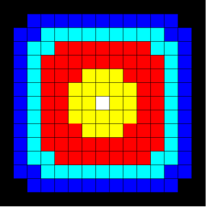</img>

Inicialmente, neste problema, as linhas e as colunas dos contornos (extremidades) da matriz serão de valor 0 e, a partir destas ao centro, teremos valores crescendo gradativamente, de modo que o centro tenha os maiores valores. Tais valores maiores serão definidos por uma função inicial com índices da matriz, que serão normalizados até 1. 
Após o inicialização da matriz com valores, um algoritmo fará mapeamentos onde os valores sofrerão uma taxa de decaimento como forma de "resfriamento". Este processo será executado em 10 tempos, na qual a ultima execução terá os menores no centro e, consequentemente, o tempo em que a chapa estará mais fria entre as outras.      

### Resumo 

### Metodologia

O problema abordado neste trabalho consiste no desenvolvimento de um algoritmo que faça a inicialização de uma matriz com valores, seguido de mapeamentos que aplicam um função de decaimento nos valores, que tendem a cair e, em uma imagem, apresentar uma "chapa" menos quente.
O método é dividido em etapas que seguem desde a implementação de partes até a avaliação do algoritmo. A visão geral do método é apresentada na figura 2, onde contém partes que serão detalhadas na sequência.  

    <h3>Figura 2 - Visão geral do método</h3>
    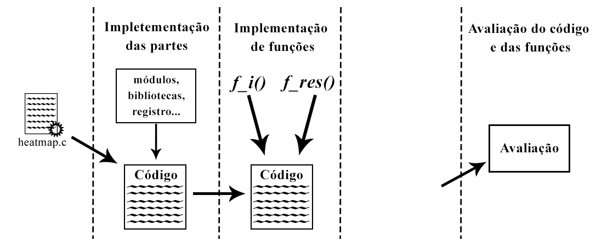</img>

#### Implementação das partes
A primeira etapa da metodologia é a implementação das partes. Inicialmente, as bibliotecas são adicionadas, sendo elas stdio e stdlib. A primeira é utilizada para implementação de funções printf() e scanf(), responsáveis por imprimir e ler dados, respectivamente. A segunda é utilizada para implementação de funções malloc() e free(), responsáveis por alocar e liberar memória às matrizes, respectivamente.
Após isto, é feito a declaração de uma struct, contendo uma matriz na forma de vetor como ponteiro. Nesta struct, foi adicionado um álias de Matrix.
O próximo passo é declarar os módulos, sejam eles de ação e resultado. Os três módulos de resultado são: retorno de linhas, de colunas e do valor máximo da matriz inicial. Os cinco módulos de ação são: inicialização da matriz com valores, mapeamento de matrizes com valores menores á matriz antecedente, matriz de tempo (responsável pelo controle de índices das structs em que contém a matriz), imprimir todas as matrizes de cada tempo e liberação de memória alocada em cada matriz.
Por fim, é adicionado o método principal (main()) onde o numero de linhas e colunas são recebidos por um input
#### Implementação de funções

#### Encontrar a constante ideal

#### Avaliação do código e das funções

### Experimentos, resultados e discussão

    

        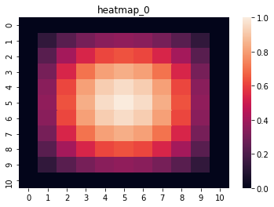
        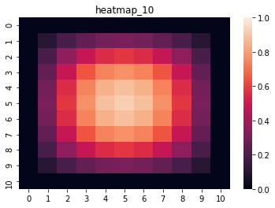
        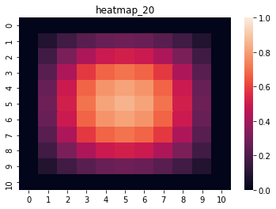
    
   
    

        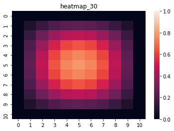
        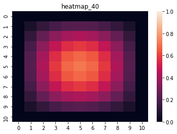
        
    
 
    

        
        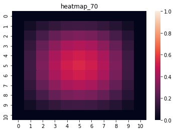
        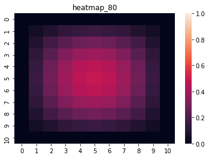
    
 
    

        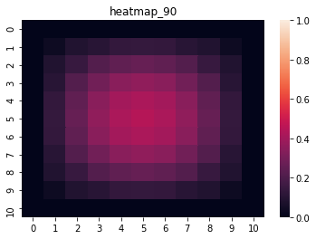
        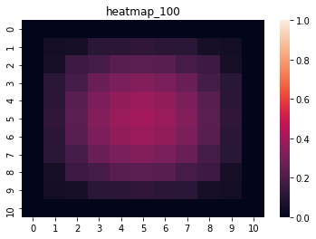
    
 

