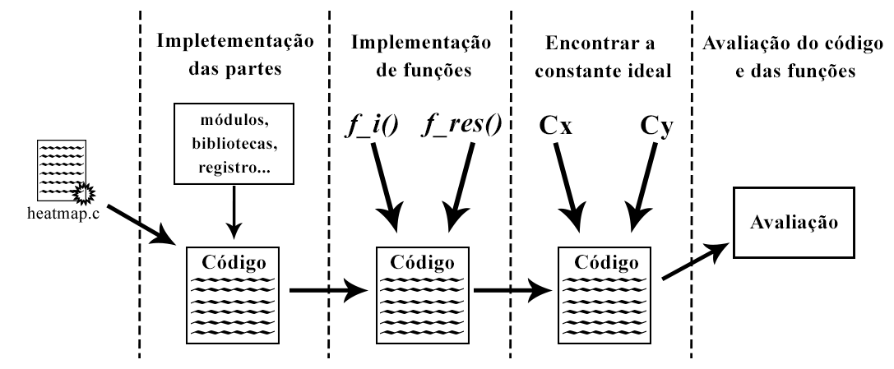
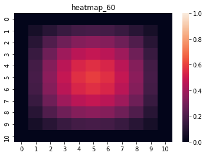

# Calorimetry_Equation-Alg-CCO
Trabalho final de Algoritmos desenvolvido no curso de CCO
## Resumo
### Entendendo o problema - equação simples de calor
Matriz, assim como uma imagem, são estruturas 2D (duas dimensões, sendo uma linha e outra coluna) que armazenam valores em seus elementos variando de 0 à qualquer valor acima de 0, como neste caso.
Esses valores serão guardados nas posições de uma tabela, na prática e, em uma imagem, as variações de valores podem formar um espectro visível de cores. 
Um exemplo é mostrado na figura 1.

    <h3>Figura 1 - Exemplo didático de variação de cores por valor. Quanto mais para as extremidades, menor é o valor, azul. Quanto mais próximo do centro, maior é o valor, vermelho.</h3>
    </img>
    <h5>Fonte: o autor</h5>

Inicialmente, neste problema, as linhas e as colunas dos contornos (extremidades) da matriz serão de valor 0 e, a partir destas ao centro, teremos valores crescendo gradativamente, de modo que o centro tenha os maiores valores. Os valores maiores que 0 serão definidos por uma função inicial com índices da matriz, que serão normalizados até 1. 
Após o inicialização da matriz com valores, um algoritmo fará mapeamentos onde os valores sofrerão uma taxa de decaimento como forma de "resfriamento". Este processo será executado em 10 tempos, na qual a ultima execução terá os menores valores e, consequentemente, o tempo em que a chapa estará mais fria entre as demais execuções.       

### Metodologia

O problema abordado neste trabalho consiste no desenvolvimento de um algoritmo que faça a inicialização de uma matriz com valores, seguido de mapeamentos que aplicam um função de decaimento nos valores, que tendem a cair e, em uma imagem, apresentar uma "chapa" menos quente.
O método é dividido em etapas que seguem desde a implementação de partes até a avaliação do algoritmo. A visão geral do método é apresentada na figura 2, onde contém partes que serão detalhadas na sequência.  

    <h3>Figura 2 - Visão geral do método</h3>
    </img>
    <h5>Fonte: o autor</h5>

A primeira etapa da metodologia é a implementação das partes. Inicialmente, as bibliotecas são adicionadas para importação de funções especiais.
Após isto, é feito a declaração de um registro, contendo uma matriz na forma de vetor com ponteiro. Neste registro, foi adicionado um álias de Matrix. Embora o conceito de registro é agrupar mais de um dado com mais de um tipos de dado, somente essa matriz de tipo float (decimal) foi adicionado.

O próximo passo é a prototipação, que é declarar os módulos com passagem de parâmetros, sejam eles por valor ou referência.
O primeiro módulo de retorno criado é return_lines, que basicamente pede ao usuário o numero de linhas para as matrizes. O mesmo acontece para o segundo módulo, porém, pede ao usuário o número de colunas. O terceiro e ultimo módulo return_max_value de retorno percorrerá a matriz inicializada, afim de encontrar o maior valor, certamente localizado no centro da matriz.

Foram usados cinco módulos de ação. O primeiro módulo matrix_inicialization setará os valores da matriz inicial utilizando a função de inicialização. Sabendo que os indices da matriz são usados para definir seus valores, a escala de valores será relativo ao número de linhas e colunas. Para isto, uma normalização entre 0 e 1 facilitará a visualização dos valores das matrizes com a adquirição do maior valor da matriz inicializada. Neste momento, uma variavel max_value guardará o valor que dará retorno de return_max_value. A normalização basicamente é feita percorrendo toda a matriz inicializada e dividindo cada valor pelo max_value.

Os módulos matrix_mapping e matrix_temp trabalham juntos. Na matrix_mapping, a primeira coisa a ser feita é zerar as bordas das matrizes, uma vez que não há uma função que anulará os cantos como houve na matriz inicial. Caso não seja borda, a função de decaimento de valor será executada. A outra matriz chamada matrix_temp alocará memória para cada vetor de registro dentro de um for (laço de repetição), seguido da execução do módulo matrix_mapping. Em resumo, matrix_temp será chamada uma vez na main, mas com o for dentro, ele fará 10 vezes a alocação de memória do vetor de structs com o controle de t e, ainda, chamará 10 vezes a função matrix_mapping.

Após todo esse processo, o módulo print_all_matrix imprimirá todas as matrizes a cada 10 tempos e, por fim, o módulo free_matrixs libera a mémoria de todas as matrizes.

Dentro da função int main (função principal), teremos duas variaveis recebendo a quantidade de linhas e colunas, respectivamente, por chamada de módulos. Prosseguindo, o registro é tranformado em um vetor de tamanho N execuções (10 tempos)+1 para a matriz inicial, contendo no total 11 posições para os mapeamentos de valores sem a necessidade de criar varias matrizes com identificadores diferentes.
Após isto, o próximo e ultimo passo é chamar a sequência de módulos para finalizar o algoritmo, que são: matrix_inicialization, matrix_temp, print_all_matrix e free_matrixs.   

Outra etapa é encontrar a constante ideal para x e y. Alguns experimentos foram feitos com 11 linhas e 11 colunas, e encontrou-se como constante ideal 0.47 antes de valores mais próximos da borda serem maiores que outros mais próximos ao centro.

### Resultados e discussão
Como resultados, imagens foram geradas por facilitar a visualização da variação dos valores conforme a figura 3. Tais imagens geradas foram feitas com 11 linhas e 11 colunas e constante de x e y em 0.47. 

    <h3>Figura 3: função de decaimento de valores sobre a matriz do tempo 0 até o tempo 100</h3>
    

        
        
        
    
   
    

        
        
        
    
 
    

        
        
        
    
 
    

        
        
    
 
    <h5>Fonte: o autor</h5>

É possivel ver que as bordas se manteram na mesma entre todos os tempos, enquanto do centro para as bordas os valores decresceram gradativamente sem nenhum valor mais longe do meio ser maior que outros valores mais próximos do centro. Vale ressaltar que se as linhas e colunas forem diferentes destas apresentadas em imagens, uma alteração nas constantes será necessária.   
