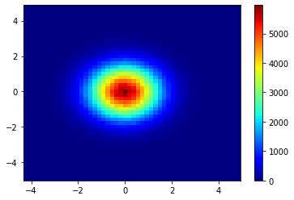

# Calorimetry_Equation-Alg-CCO
Trabalho final de Algoritmos desenvolvido na matéria de CCO

## Problema - equação simples de calor
Matriz é uma estrutura 2D (duas dimensões, sendo uma linha e outra coluna) que armazenará valores variando de 0 á qualquer valor acima de 0, neste caso.
Esses valores são guardados nas posiçoes de uma tabela e, em uma imagem, as variações de valores podem formar um espectro visível de cores. 
Inicialmente, os contornos (extremidades) da matriz serão de valor 0 e, mais perto do centro, teremos os valores maiores.
Um exemplo é mostrado na imagem 1.

    <h3>Imagem 1 - Calor distribuido do centro para as bordas</h3>
    </img>

### Resumo 

### Metodologia

### Resultados e discussão

